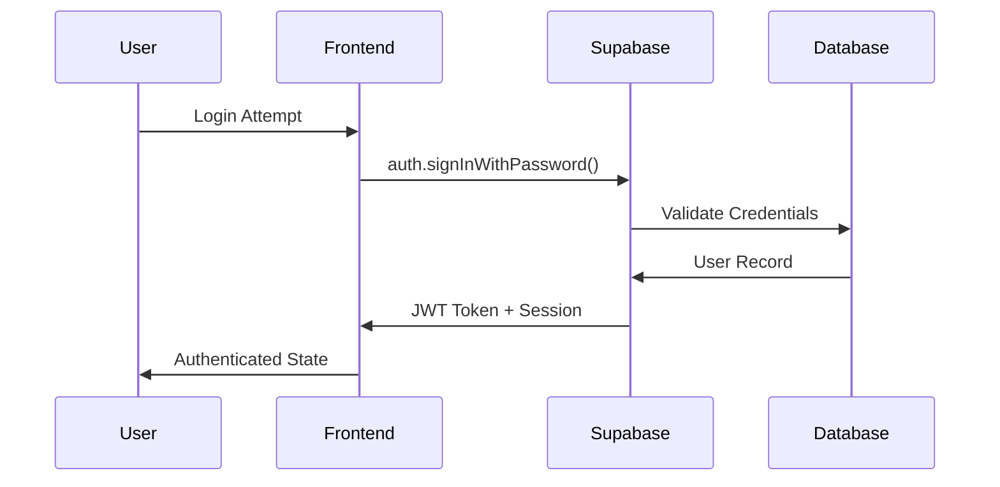

# YumZoom Security Documentation
## Authentication, Authorization & Security Implementation

---

## Table of Contents

1. [Security Overview](#security-overview)
2. [Authentication System](#authentication-system)
3. [Authorization & Access Control](#authorization--access-control)
4. [Data Protection](#data-protection)
5. [API Security](#api-security)
6. [Privacy Compliance](#privacy-compliance)
7. [Security Monitoring](#security-monitoring)
8. [Incident Response](#incident-response)
9. [Security Best Practices](#security-best-practices)

---

## Security Overview

### Security Architecture

YumZoom implements a multi-layered security approach with comprehensive role-based access control:

```
┌─────────────────────────────────────────────────────────┐
│                    Application Layer                    │
│  • Input Validation  • CSRF Protection  • XSS Prevention │
├─────────────────────────────────────────────────────────┤
│                  Authentication Layer                   │
│  • JWT Tokens  • Session Management  • 2FA Support      │
├─────────────────────────────────────────────────────────┤
│                  Authorization Layer                    │
│  • RBAC System  • Row Level Security  • Role Policies   │
├─────────────────────────────────────────────────────────┤
│                Role-Based Access Control                │
│  • 4-Tier Roles  • Protected Routes  • Component Guards │
├─────────────────────────────────────────────────────────┤
│                    Database Layer                       │
│  • Encryption at Rest  • Connection Security  • Auditing │
├─────────────────────────────────────────────────────────┤
│                 Infrastructure Layer                    │
│  • TLS/SSL  • Network Security  • Environment Isolation │
└─────────────────────────────────────────────────────────┘
```

### Security Principles

1. **Zero Trust Architecture**: Verify every request and user
2. **Role-Based Security**: 4-tier access control system (Customer, Restaurant Owner, Business Partner, Admin)
3. **Least Privilege Access**: Minimum necessary permissions
4. **Defense in Depth**: Multiple security layers
5. **Privacy by Design**: Built-in privacy protection
6. **Continuous Monitoring**: Real-time threat detection

### Compliance Standards

- **GDPR**: General Data Protection Regulation compliance
- **CCPA**: California Consumer Privacy Act compliance
- **COPPA**: Children's Online Privacy Protection Act
- **SOC 2 Type II**: Security controls (via Supabase)
- **ISO 27001**: Information security management (via Supabase)

---

## Authentication System

### Supabase Authentication

#### Authentication Flow


#### JWT Token Structure
```typescript
interface JWTPayload {
  aud: string;           // Audience (authenticated)
  exp: number;           // Expiration timestamp
  sub: string;           // Subject (user ID)
  email: string;         // User email
  phone?: string;        // User phone (if provided)
  user_metadata: {       // Custom user data
    first_name?: string;
    last_name?: string;
  };
  role: string;          // User role (authenticated/anon)
  aal: string;           // Authentication Assurance Level
}
```

### Authentication Implementation

#### Client-Side Authentication
```typescript
// lib/auth.ts
import { createClient } from '@supabase/supabase-js';

const supabase = createClient(
  process.env.NEXT_PUBLIC_SUPABASE_URL!,
  process.env.NEXT_PUBLIC_SUPABASE_ANON_KEY!
);

// Sign up with email and password
export async function signUp(email: string, password: string, metadata: any) {
  const { data, error } = await supabase.auth.signUp({
    email,
    password,
    options: {
      data: metadata,
      emailRedirectTo: `${window.location.origin}/auth/callback`
    }
  });
  
  return { data, error };
}

// Sign in with email and password
export async function signIn(email: string, password: string) {
  const { data, error } = await supabase.auth.signInWithPassword({
    email,
    password
  });
  
  return { data, error };
}

// Get current session
export async function getSession() {
  const { data: { session }, error } = await supabase.auth.getSession();
  return { session, error };
}
```

#### Server-Side Authentication
```typescript
// lib/server-auth.ts
import { createServerComponentClient } from '@supabase/auth-helpers-nextjs';
import { cookies } from 'next/headers';

export async function getServerSession() {
  const supabase = createServerComponentClient({ 
    cookies: () => cookies() 
  });
  
  const { data: { session }, error } = await supabase.auth.getSession();
  return { session, error };
}

// Middleware for API routes
export async function authenticateRequest(request: NextRequest) {
  const token = request.headers.get('authorization')?.replace('Bearer ', '');
  
  if (!token) {
    return { user: null, error: 'No token provided' };
  }
  
  const { data: { user }, error } = await supabase.auth.getUser(token);
  return { user, error };
}
```

### Password Security

#### Password Requirements
```typescript
// Password validation schema
const passwordSchema = z.string()
  .min(8, 'Password must be at least 8 characters')
  .regex(/[A-Z]/, 'Password must contain at least one uppercase letter')
  .regex(/[a-z]/, 'Password must contain at least one lowercase letter')
  .regex(/[0-9]/, 'Password must contain at least one number')
  .regex(/[^A-Za-z0-9]/, 'Password must contain at least one special character');
```

#### Password Reset Flow
```typescript
// Password reset request
export async function resetPassword(email: string) {
  const { error } = await supabase.auth.resetPasswordForEmail(email, {
    redirectTo: `${window.location.origin}/auth/reset-password`
  });
  
  return { error };
}

// Password update
export async function updatePassword(newPassword: string) {
  const { error } = await supabase.auth.updateUser({
    password: newPassword
  });
  
  return { error };
}
```

### Two-Factor Authentication (2FA)

#### 2FA Setup Implementation
```typescript
// lib/two-factor-auth.ts
import { authenticator } from 'otplib';
import QRCode from 'qrcode';

class TwoFactorAuthService {
  async setupTwoFactor(userId: string, userEmail: string) {
    // Generate secret
    const secret = authenticator.generateSecret();
    
    // Create OTP Auth URL
    const otpAuthUrl = authenticator.keyuri(
      userEmail,
      'YumZoom',
      secret
    );
    
    // Generate QR code
    const qrCodeDataUrl = await QRCode.toDataURL(otpAuthUrl);
    
    // Generate backup codes
    const backupCodes = this.generateBackupCodes();
    
    // Store in database (encrypted)
    await this.storeTwoFactorData(userId, secret, backupCodes);
    
    return {
      secret,
      qrCode: qrCodeDataUrl,
      backupCodes
    };
  }
  
  async verifyTwoFactorToken(userId: string, token: string) {
    const userData = await this.getTwoFactorData(userId);
    
    if (!userData.secret) {
      return { valid: false, error: '2FA not enabled' };
    }
    
    // Verify TOTP token
    const isValid = authenticator.verify({
      token,
      secret: userData.secret
    });
    
    // Check backup codes if TOTP fails
    if (!isValid && userData.backupCodes.includes(token)) {
      await this.consumeBackupCode(userId, token);
      return { valid: true, usedBackupCode: true };
    }
    
    return { valid: isValid };
  }
  
  private generateBackupCodes(): string[] {
    return Array.from({ length: 10 }, () => 
      Math.random().toString(36).substring(2, 10).toUpperCase()
    );
  }
}

export const twoFactorAuthService = new TwoFactorAuthService();
```

#### 2FA Database Schema
```sql
CREATE TABLE user_two_factor (
    id uuid DEFAULT uuid_generate_v4() PRIMARY KEY,
    user_id uuid REFERENCES auth.users(id) ON DELETE CASCADE NOT NULL UNIQUE,
    secret_encrypted text,
    backup_codes_encrypted text[],
    is_enabled boolean DEFAULT false,
    enabled_at timestamp with time zone,
    last_used_at timestamp with time zone,
    created_at timestamp with time zone DEFAULT timezone('utc'::text, now()) NOT NULL,
    updated_at timestamp with time zone DEFAULT timezone('utc'::text, now()) NOT NULL
);

-- RLS policies
ALTER TABLE user_two_factor ENABLE ROW LEVEL SECURITY;

CREATE POLICY "Users can manage their own 2FA" ON user_two_factor
    FOR ALL USING (auth.uid() = user_id);
```

---

## Authorization & Access Control

### Role-Based Access Control (RBAC) System

YumZoom implements a comprehensive 4-tier role-based access control system:

#### User Role Hierarchy
```typescript
export type UserRole = 'customer' | 'restaurant_owner' | 'business_partner' | 'admin';

export const ROLE_HIERARCHY = {
  customer: 0,
  restaurant_owner: 1,
  business_partner: 2,
  admin: 3
} as const;

export const ROLE_PERMISSIONS = {
  customer: [
    'view_restaurants',
    'rate_restaurants',
    'manage_family',
    'view_dashboard',
    'social_features'
  ],
  restaurant_owner: [
    'view_restaurants',
    'rate_restaurants',
    'manage_family',
    'view_dashboard',
    'social_features',
    'restaurant_analytics',
    'manage_restaurant',
    'respond_reviews'
  ],
  business_partner: [
    'view_restaurants',
    'rate_restaurants',
    'manage_family',
    'view_dashboard',
    'social_features',
    'business_analytics',
    'market_insights',
    'partnership_tools'
  ],
  admin: [
    'view_restaurants',
    'rate_restaurants',
    'manage_family',
    'view_dashboard',
    'social_features',
    'restaurant_analytics',
    'manage_restaurant',
    'respond_reviews',
    'business_analytics',
    'market_insights',
    'partnership_tools',
    'admin_panel',
    'user_management',
    'system_config',
    'content_moderation'
  ]
} as const;
```

#### Component-Level Protection
```typescript
// components/auth/RoleGuard.tsx
export function RoleGuard({ 
  children, 
  allowedRoles, 
  fallback 
}: {
  children: React.ReactNode;
  allowedRoles: UserRole[];
  fallback?: React.ReactNode;
}) {
  const { userRole, loading } = useUserRole();
  
  if (loading) {
    return <div>Loading...</div>;
  }
  
  if (!userRole || !allowedRoles.includes(userRole)) {
    return fallback || <UnauthorizedAccess />;
  }
  
  return <>{children}</>;
}

// Specific role guards
export const AdminOnly = ({ children }: { children: React.ReactNode }) => (
  <RoleGuard allowedRoles={['admin']}>{children}</RoleGuard>
);

export const RestaurantOwnerOnly = ({ children }: { children: React.ReactNode }) => (
  <RoleGuard allowedRoles={['restaurant_owner', 'admin']}>{children}</RoleGuard>
);

export const BusinessPartnerOnly = ({ children }: { children: React.ReactNode }) => (
  <RoleGuard allowedRoles={['business_partner', 'admin']}>{children}</RoleGuard>
);
```

#### Route Protection
```typescript
// lib/rbac.ts
export function getAccessibleNavItems(userRole: UserRole | null): NavItem[] {
  if (!userRole) return PUBLIC_NAV_ITEMS;
  
  const allItems = [
    { href: '/dashboard', label: 'Dashboard', roles: ['customer', 'restaurant_owner', 'business_partner', 'admin'] },
    { href: '/restaurants', label: 'Restaurants', roles: ['customer', 'restaurant_owner', 'business_partner', 'admin'] },
    { href: '/family', label: 'Family', roles: ['customer', 'restaurant_owner', 'business_partner', 'admin'] },
    { href: '/restaurant-owner', label: 'Restaurant Owner', roles: ['restaurant_owner', 'admin'] },
    { href: '/business-dashboard', label: 'Business Dashboard', roles: ['business_partner', 'admin'] },
    { href: '/admin', label: 'Admin', roles: ['admin'] }
  ];
  
  return allItems.filter(item => item.roles.includes(userRole));
}
```

### Row Level Security (RLS)

#### User Data Protection
```sql
-- User profiles: Users can only access their own data
CREATE POLICY "Users can view their own profile" ON user_profiles
    FOR SELECT USING (auth.uid() = id);

CREATE POLICY "Users can update their own profile" ON user_profiles
    FOR UPDATE USING (auth.uid() = id);

-- Family members: Users can only manage their own family
CREATE POLICY "Users can manage their own family members" ON family_members
    FOR ALL USING (auth.uid() = user_id);

-- Ratings: Users can manage their own ratings, public read access
CREATE POLICY "Users can manage their own ratings" ON ratings
    FOR ALL USING (auth.uid() = user_id);

CREATE POLICY "Public read access to ratings" ON ratings
    FOR SELECT USING (true);
```

#### Privacy-Based Access Control
```sql
-- Respect family member privacy settings
CREATE POLICY "Respect privacy settings" ON family_members
    FOR SELECT USING (
        -- Own family members
        user_id = auth.uid() OR 
        -- Public profiles
        privacy_level = 'public' OR 
        -- Friends can see friend-level privacy
        (privacy_level = 'friends' AND EXISTS (
            SELECT 1 FROM social_connections sc 
            WHERE sc.follower_id = auth.uid() 
            AND sc.following_id = user_id 
            AND sc.status = 'accepted'
        )) OR
        -- Family can see family-level privacy (for extended family features)
        (privacy_level = 'family' AND EXISTS (
            SELECT 1 FROM family_connections fc
            WHERE fc.user_id = auth.uid()
            AND fc.connected_family_id = (
                SELECT family_id FROM user_profiles WHERE id = user_id
            )
        ))
    );
```

#### Role-Based Access Control
```sql
-- User profiles with role-based access
CREATE POLICY "Users can view their own profile" ON user_profiles
    FOR SELECT USING (auth.uid() = id);

CREATE POLICY "Users can update their own profile" ON user_profiles
    FOR UPDATE USING (auth.uid() = id);

-- Admin access policies
CREATE POLICY "Admins can access all restaurants" ON restaurants
    FOR ALL USING (
        EXISTS (
            SELECT 1 FROM user_profiles up 
            WHERE up.id = auth.uid() 
            AND up.user_role = 'admin'
        )
    );

-- Restaurant owner access
CREATE POLICY "Restaurant owners can manage their restaurants" ON restaurants
    FOR UPDATE USING (
        EXISTS (
            SELECT 1 FROM restaurant_owners ro
            WHERE ro.user_id = auth.uid()
            AND ro.restaurant_id = restaurants.id
            AND ro.verification_status = 'verified'
        )
    );

-- Business partner access
CREATE POLICY "Business partners can access analytics" ON restaurant_analytics
    FOR SELECT USING (
        EXISTS (
            SELECT 1 FROM user_profiles up 
            WHERE up.id = auth.uid() 
            AND up.user_role IN ('business_partner', 'admin')
        )
    );
```

### API Authorization

#### Route Protection Middleware
```typescript
// middleware.ts
import { createMiddlewareClient } from '@supabase/auth-helpers-nextjs';
import { NextResponse } from 'next/server';
import type { NextRequest } from 'next/server';

export async function middleware(req: NextRequest) {
  const res = NextResponse.next();
  const supabase = createMiddlewareClient({ req, res });
  
  // Protected routes that require authentication
  const protectedPaths = [
    '/dashboard',
    '/family',
    '/analytics',
    '/restaurant-owner',
    '/admin'
  ];
  
  // Admin-only routes
  const adminPaths = ['/admin'];
  
  // Restaurant owner routes
  const ownerPaths = ['/restaurant-owner'];
  
  const { data: { session } } = await supabase.auth.getSession();
  
  // Check if route requires authentication
  if (protectedPaths.some(path => req.nextUrl.pathname.startsWith(path))) {
    if (!session) {
      return NextResponse.redirect(new URL('/auth/signin', req.url));
    }
    
    // Check admin access
    if (adminPaths.some(path => req.nextUrl.pathname.startsWith(path))) {
      const { data: profile } = await supabase
        .from('user_profiles')
        .select('user_role')
        .eq('id', session.user.id)
        .single();
      
      if (profile?.user_role !== 'admin') {
        return NextResponse.redirect(new URL('/unauthorized', req.url));
      }
    }
    
    // Check restaurant owner access
    if (ownerPaths.some(path => req.nextUrl.pathname.startsWith(path))) {
      const { data: owner } = await supabase
        .from('restaurant_owners')
        .select('verification_status')
        .eq('user_id', session.user.id)
        .single();
      
      if (!owner || owner.verification_status !== 'verified') {
        return NextResponse.redirect(new URL('/restaurant-owner/verify', req.url));
      }
    }
  }
  
  return res;
}

export const config = {
  matcher: [
    '/((?!api|_next/static|_next/image|favicon.ico).*)',
  ],
};
```

#### API Route Authorization
```typescript
// API authorization helper
export async function authorizeRequest(
  request: NextRequest,
  requiredRole?: 'admin' | 'restaurant_owner'
) {
  const { user, error } = await authenticateRequest(request);
  
  if (error || !user) {
    return { authorized: false, user: null, error: 'Unauthorized' };
  }
  
  // Check role requirements
  if (requiredRole) {
    if (requiredRole === 'admin') {
      const { data: profile } = await supabase
        .from('user_profiles')
        .select('user_role')
        .eq('id', user.id)
        .single();
      
      if (profile?.user_role !== 'admin') {
        return { authorized: false, user, error: 'Admin access required' };
      }
    }
    
    if (requiredRole === 'restaurant_owner') {
      const { data: owner } = await supabase
        .from('restaurant_owners')
        .select('verification_status')
        .eq('user_id', user.id)
        .eq('verification_status', 'verified')
        .single();
      
      if (!owner) {
        return { authorized: false, user, error: 'Restaurant owner verification required' };
      }
    }
  }
  
  return { authorized: true, user, error: null };
}
```

---

## Data Protection

### Encryption

#### Data at Rest
- **Database Encryption**: AES-256 encryption (Supabase managed)
- **File Storage Encryption**: Object storage encryption (Supabase managed)
- **Backup Encryption**: Encrypted backups with key rotation

#### Data in Transit
```typescript
// TLS/SSL configuration
const tlsConfig = {
  minVersion: 'TLSv1.2',
  ciphers: [
    'ECDHE-RSA-AES128-GCM-SHA256',
    'ECDHE-RSA-AES256-GCM-SHA384',
    'ECDHE-RSA-AES128-SHA256',
    'ECDHE-RSA-AES256-SHA384'
  ],
  honorCipherOrder: true
};
```

#### Sensitive Data Encryption
```typescript
// lib/encryption.ts
import crypto from 'crypto';

class EncryptionService {
  private algorithm = 'aes-256-gcm';
  private secretKey = process.env.ENCRYPTION_SECRET_KEY!;
  
  encrypt(text: string): { encrypted: string; iv: string; tag: string } {
    const iv = crypto.randomBytes(16);
    const cipher = crypto.createCipher(this.algorithm, this.secretKey);
    cipher.setAAD(Buffer.from('YumZoom', 'utf8'));
    
    let encrypted = cipher.update(text, 'utf8', 'hex');
    encrypted += cipher.final('hex');
    
    const tag = cipher.getAuthTag();
    
    return {
      encrypted,
      iv: iv.toString('hex'),
      tag: tag.toString('hex')
    };
  }
  
  decrypt(encryptedData: { encrypted: string; iv: string; tag: string }): string {
    const decipher = crypto.createDecipher(this.algorithm, this.secretKey);
    decipher.setAAD(Buffer.from('YumZoom', 'utf8'));
    decipher.setAuthTag(Buffer.from(encryptedData.tag, 'hex'));
    
    let decrypted = decipher.update(encryptedData.encrypted, 'hex', 'utf8');
    decrypted += decipher.final('utf8');
    
    return decrypted;
  }
}

export const encryptionService = new EncryptionService();
```

### Input Validation & Sanitization

#### Schema Validation with Zod
```typescript
// lib/validation.ts
import { z } from 'zod';

// User registration validation
export const userRegistrationSchema = z.object({
  email: z.string().email('Invalid email format'),
  password: z.string()
    .min(8, 'Password must be at least 8 characters')
    .regex(/[A-Z]/, 'Must contain uppercase letter')
    .regex(/[a-z]/, 'Must contain lowercase letter')
    .regex(/[0-9]/, 'Must contain number')
    .regex(/[^A-Za-z0-9]/, 'Must contain special character'),
  firstName: z.string()
    .min(1, 'First name required')
    .max(50, 'First name too long')
    .regex(/^[a-zA-Z\s]*$/, 'Only letters and spaces allowed'),
  lastName: z.string()
    .min(1, 'Last name required')
    .max(50, 'Last name too long')
    .regex(/^[a-zA-Z\s]*$/, 'Only letters and spaces allowed'),
  phone: z.string()
    .regex(/^\+?[\d\s\-\(\)]+$/, 'Invalid phone format')
    .optional()
});

// Rating submission validation
export const ratingSchema = z.object({
  menuItemId: z.string().uuid('Invalid menu item ID'),
  rating: z.number().min(1).max(10),
  familyMemberId: z.string().uuid().optional(),
  notes: z.string().max(500, 'Notes too long').optional(),
  reviewText: z.string().max(500, 'Review too long').optional()
});

// Sanitization function
export function sanitizeInput(input: string): string {
  return input
    .replace(/<script\b[^<]*(?:(?!<\/script>)<[^<]*)*<\/script>/gi, '') // Remove scripts
    .replace(/[<>]/g, '') // Remove HTML brackets
    .trim(); // Remove whitespace
}
```

#### API Input Validation
```typescript
// API route with validation
export async function POST(request: NextRequest) {
  try {
    const body = await request.json();
    
    // Validate input
    const validatedData = ratingSchema.parse(body);
    
    // Sanitize text inputs
    if (validatedData.notes) {
      validatedData.notes = sanitizeInput(validatedData.notes);
    }
    if (validatedData.reviewText) {
      validatedData.reviewText = sanitizeInput(validatedData.reviewText);
    }
    
    // Process request with validated data
    // ...
    
  } catch (error) {
    if (error instanceof z.ZodError) {
      return NextResponse.json({
        success: false,
        error: {
          code: 'VALIDATION_ERROR',
          message: 'Invalid input data',
          details: error.errors
        }
      }, { status: 400 });
    }
    
    // Handle other errors
    return NextResponse.json({
      success: false,
      error: { code: 'INTERNAL_ERROR', message: 'Server error' }
    }, { status: 500 });
  }
}
```

### CSRF Protection

#### Next.js Built-in Protection
```typescript
// Next.js automatically includes CSRF protection for:
// - Form submissions with POST, PUT, PATCH, DELETE
// - API routes with SameSite cookie settings
// - CORS configuration

// Additional CSRF token validation
export function validateCSRFToken(request: NextRequest): boolean {
  const token = request.headers.get('X-CSRF-Token');
  const sessionToken = request.cookies.get('csrf-token')?.value;
  
  return token === sessionToken;
}
```

### XSS Prevention

#### Content Security Policy
```typescript
// next.config.js
const nextConfig = {
  async headers() {
    return [
      {
        source: '/(.*)',
        headers: [
          {
            key: 'Content-Security-Policy',
            value: [
              "default-src 'self'",
              "script-src 'self' 'unsafe-inline' 'unsafe-eval' https://vercel.live",
              "style-src 'self' 'unsafe-inline' https://fonts.googleapis.com",
              "img-src 'self' data: https: blob:",
              "font-src 'self' https://fonts.gstatic.com",
              "connect-src 'self' https://*.supabase.co wss://*.supabase.co",
              "frame-src 'none'",
              "object-src 'none'",
              "base-uri 'self'",
              "form-action 'self'",
              "frame-ancestors 'none'"
            ].join('; ')
          },
          {
            key: 'X-Frame-Options',
            value: 'DENY'
          },
          {
            key: 'X-Content-Type-Options',
            value: 'nosniff'
          },
          {
            key: 'Referrer-Policy',
            value: 'strict-origin-when-cross-origin'
          },
          {
            key: 'Permissions-Policy',
            value: 'camera=(), microphone=(), geolocation=(self)'
          }
        ]
      }
    ];
  }
};
```

---

## API Security

### Rate Limiting

#### Implementation
```typescript
// lib/rate-limiting.ts
import { Redis } from '@upstash/redis';

const redis = new Redis({
  url: process.env.UPSTASH_REDIS_REST_URL!,
  token: process.env.UPSTASH_REDIS_REST_TOKEN!
});

interface RateLimitConfig {
  requests: number;
  window: number; // seconds
}

export class RateLimiter {
  async checkRateLimit(
    identifier: string,
    config: RateLimitConfig
  ): Promise<{ success: boolean; remaining: number; resetTime: number }> {
    const key = `rate_limit:${identifier}`;
    const now = Date.now();
    const window = config.window * 1000; // convert to milliseconds
    
    // Get current count
    const current = await redis.get(key) as number || 0;
    
    if (current >= config.requests) {
      const ttl = await redis.ttl(key);
      return {
        success: false,
        remaining: 0,
        resetTime: now + (ttl * 1000)
      };
    }
    
    // Increment counter
    await redis.incr(key);
    await redis.expire(key, config.window);
    
    return {
      success: true,
      remaining: config.requests - current - 1,
      resetTime: now + window
    };
  }
}

// Rate limit middleware
export async function rateLimit(
  request: NextRequest,
  config: RateLimitConfig
) {
  const limiter = new RateLimiter();
  const ip = request.ip || request.headers.get('x-forwarded-for') || 'anonymous';
  const identifier = `${ip}:${request.nextUrl.pathname}`;
  
  const result = await limiter.checkRateLimit(identifier, config);
  
  if (!result.success) {
    return new NextResponse(
      JSON.stringify({
        success: false,
        error: {
          code: 'RATE_LIMIT_EXCEEDED',
          message: 'Too many requests',
          retryAfter: Math.ceil((result.resetTime - Date.now()) / 1000)
        }
      }),
      {
        status: 429,
        headers: {
          'Content-Type': 'application/json',
          'X-RateLimit-Limit': config.requests.toString(),
          'X-RateLimit-Remaining': result.remaining.toString(),
          'X-RateLimit-Reset': result.resetTime.toString(),
          'Retry-After': Math.ceil((result.resetTime - Date.now()) / 1000).toString()
        }
      }
    );
  }
  
  return null; // Continue processing
}
```

#### Usage in API Routes
```typescript
// API route with rate limiting
export async function POST(request: NextRequest) {
  // Apply rate limiting
  const rateLimitResponse = await rateLimit(request, {
    requests: 10,
    window: 60 // 10 requests per minute
  });
  
  if (rateLimitResponse) {
    return rateLimitResponse;
  }
  
  // Continue with normal processing
  // ...
}
```

### API Key Security

#### API Key Generation and Management
```typescript
// lib/api-keys.ts
import crypto from 'crypto';

export class ApiKeyManager {
  generateApiKey(): { apiKey: string; apiSecret: string } {
    const apiKey = 'yz_' + crypto.randomBytes(16).toString('hex');
    const apiSecret = crypto.randomBytes(32).toString('hex');
    
    return { apiKey, apiSecret };
  }
  
  async validateApiKey(apiKey: string, apiSecret: string): Promise<boolean> {
    const { data: application } = await supabase
      .from('api_applications')
      .select('*')
      .eq('api_key', apiKey)
      .eq('status', 'approved')
      .single();
    
    if (!application) {
      return false;
    }
    
    // Verify secret with timing-safe comparison
    const providedSecret = Buffer.from(apiSecret);
    const storedSecret = Buffer.from(application.api_secret);
    
    if (providedSecret.length !== storedSecret.length) {
      return false;
    }
    
    return crypto.timingSafeEqual(providedSecret, storedSecret);
  }
  
  async logApiUsage(
    applicationId: string,
    endpoint: string,
    statusCode: number,
    responseTime: number
  ) {
    await supabase.from('api_usage_logs').insert({
      application_id: applicationId,
      endpoint,
      status_code: statusCode,
      response_time_ms: responseTime,
      timestamp: new Date().toISOString()
    });
  }
}
```

### CORS Configuration

#### CORS Setup
```typescript
// lib/cors.ts
export const corsOptions = {
  origin: (origin: string | undefined, callback: Function) => {
    // Allow requests with no origin (mobile apps, etc.)
    if (!origin) return callback(null, true);
    
    // Check against allowed origins
    const allowedOrigins = [
      'https://yumzoom.com',
      'https://www.yumzoom.com',
      'https://app.yumzoom.com',
      ...(process.env.NODE_ENV === 'development' 
        ? ['http://localhost:3000', 'http://127.0.0.1:3000'] 
        : [])
    ];
    
    if (allowedOrigins.includes(origin)) {
      callback(null, true);
    } else {
      callback(new Error('Not allowed by CORS'));
    }
  },
  credentials: true,
  methods: ['GET', 'POST', 'PUT', 'DELETE', 'OPTIONS'],
  allowedHeaders: [
    'Content-Type',
    'Authorization',
    'X-API-Key',
    'X-API-Secret',
    'X-Requested-With'
  ],
  exposedHeaders: [
    'X-RateLimit-Limit',
    'X-RateLimit-Remaining',
    'X-RateLimit-Reset'
  ]
};
```

---

## Privacy Compliance

### GDPR Compliance

#### Data Subject Rights Implementation
```typescript
// lib/gdpr-compliance.ts
export class GDPRComplianceService {
  // Right to Access
  async exportUserData(userId: string): Promise<any> {
    const userData = await Promise.all([
      // User profile
      supabase.from('user_profiles').select('*').eq('id', userId),
      
      // Family members
      supabase.from('family_members').select('*').eq('user_id', userId),
      
      // Ratings and reviews
      supabase.from('ratings').select(`
        *,
        review_photos(*),
        menu_item:menu_items(name, restaurant:restaurants(name))
      `).eq('user_id', userId),
      
      // Social connections
      supabase.from('social_connections').select('*')
        .or(`follower_id.eq.${userId},following_id.eq.${userId}`),
      
      // Preferences
      supabase.from('user_preferences').select('*').eq('user_id', userId)
    ]);
    
    return {
      profile: userData[0].data,
      familyMembers: userData[1].data,
      ratings: userData[2].data,
      socialConnections: userData[3].data,
      preferences: userData[4].data,
      exportedAt: new Date().toISOString()
    };
  }
  
  // Right to Erasure (Right to be Forgotten)
  async deleteUserData(userId: string): Promise<void> {
    await supabase.rpc('delete_user_data_gdpr', { user_uuid: userId });
  }
  
  // Right to Rectification
  async updateUserData(userId: string, updates: any): Promise<void> {
    // Validate and sanitize updates
    const validatedUpdates = this.validateUserUpdates(updates);
    
    await supabase
      .from('user_profiles')
      .update(validatedUpdates)
      .eq('id', userId);
  }
  
  // Right to Data Portability
  async generateDataExport(userId: string, format: 'json' | 'csv'): Promise<string> {
    const userData = await this.exportUserData(userId);
    
    if (format === 'csv') {
      return this.convertToCSV(userData);
    }
    
    return JSON.stringify(userData, null, 2);
  }
  
  private validateUserUpdates(updates: any): any {
    // Implement validation logic
    return updates;
  }
  
  private convertToCSV(data: any): string {
    // Implement CSV conversion
    return '';
  }
}
```

#### Privacy Settings Management
```typescript
// Privacy settings schema
export const privacySettingsSchema = z.object({
  profileVisibility: z.enum(['public', 'friends', 'private']),
  activitySharing: z.boolean(),
  photoSharing: z.boolean(),
  locationSharing: z.boolean(),
  analyticsSharing: z.boolean(),
  marketingEmails: z.boolean(),
  notificationPreferences: z.object({
    email: z.boolean(),
    push: z.boolean(),
    sms: z.boolean()
  })
});

// Privacy settings API
export async function updatePrivacySettings(
  userId: string,
  settings: z.infer<typeof privacySettingsSchema>
) {
  const validatedSettings = privacySettingsSchema.parse(settings);
  
  await supabase
    .from('user_preferences')
    .upsert({
      user_id: userId,
      privacy_settings: validatedSettings,
      updated_at: new Date().toISOString()
    });
}
```

### COPPA Compliance (Children's Privacy)

#### Child Account Protection
```typescript
// Child account detection and protection
export function isChildAccount(dateOfBirth: string): boolean {
  const age = new Date().getFullYear() - new Date(dateOfBirth).getFullYear();
  return age < 13;
}

// Automatic privacy protection for children
export async function createFamilyMember(memberData: any) {
  // Determine if child
  const isChild = memberData.age_range === 'child' || 
    (memberData.date_of_birth && isChildAccount(memberData.date_of_birth));
  
  if (isChild) {
    // Apply maximum privacy protection
    memberData.privacy_level = 'private';
    memberData.social_features_enabled = false;
    memberData.photo_sharing_enabled = false;
    memberData.location_sharing_enabled = false;
  }
  
  const { data, error } = await supabase
    .from('family_members')
    .insert(memberData);
  
  return { data, error };
}
```

---

## Security Monitoring

### Audit Logging

#### Security Event Logging
```typescript
// lib/audit-logger.ts
export class AuditLogger {
  async log(event: {
    userId?: string;
    action: string;
    resource: string;
    details?: any;
    ipAddress?: string;
    userAgent?: string;
    success: boolean;
    timestamp?: string;
  }) {
    await supabase.from('audit_logs').insert({
      user_id: event.userId,
      action: event.action,
      resource: event.resource,
      details: event.details || {},
      ip_address: event.ipAddress,
      user_agent: event.userAgent,
      success: event.success,
      timestamp: event.timestamp || new Date().toISOString()
    });
  }
  
  // High-priority security events
  async logSecurityEvent(event: {
    type: 'failed_login' | 'password_reset' | 'account_lockout' | 'suspicious_activity';
    userId?: string;
    details: any;
    ipAddress: string;
    userAgent: string;
  }) {
    await this.log({
      userId: event.userId,
      action: `security.${event.type}`,
      resource: 'authentication',
      details: event.details,
      ipAddress: event.ipAddress,
      userAgent: event.userAgent,
      success: false
    });
    
    // Alert on critical events
    if (['account_lockout', 'suspicious_activity'].includes(event.type)) {
      await this.sendSecurityAlert(event);
    }
  }
  
  private async sendSecurityAlert(event: any) {
    // Implementation for security alerting
    console.warn('Security Alert:', event);
  }
}

export const auditLogger = new AuditLogger();
```

#### Usage in Authentication
```typescript
// Authentication with audit logging
export async function signIn(email: string, password: string, request: NextRequest) {
  const ipAddress = request.ip || request.headers.get('x-forwarded-for') || 'unknown';
  const userAgent = request.headers.get('user-agent') || 'unknown';
  
  try {
    const { data, error } = await supabase.auth.signInWithPassword({
      email,
      password
    });
    
    if (error) {
      await auditLogger.logSecurityEvent({
        type: 'failed_login',
        details: { email, error: error.message },
        ipAddress,
        userAgent
      });
      
      return { data: null, error };
    }
    
    await auditLogger.log({
      userId: data.user.id,
      action: 'auth.signin',
      resource: 'authentication',
      details: { email },
      ipAddress,
      userAgent,
      success: true
    });
    
    return { data, error: null };
    
  } catch (err) {
    await auditLogger.logSecurityEvent({
      type: 'failed_login',
      details: { email, error: 'System error' },
      ipAddress,
      userAgent
    });
    
    throw err;
  }
}
```

### Intrusion Detection

#### Suspicious Activity Detection
```typescript
// lib/intrusion-detection.ts
export class IntrusionDetectionService {
  async analyzeRequest(request: NextRequest): Promise<{
    riskScore: number;
    threats: string[];
    blocked: boolean;
  }> {
    const threats: string[] = [];
    let riskScore = 0;
    
    // Check for SQL injection patterns
    const sqlPatterns = [
      /(\bunion\b.*\bselect\b)|(\bselect\b.*\bunion\b)/i,
      /(\bdrop\b.*\btable\b)|(\btable\b.*\bdrop\b)/i,
      /(\binsert\b.*\binto\b)|(\binto\b.*\binsert\b)/i,
      /'.*or.*'.*=.*'/i,
      /exec\s*\(/i
    ];
    
    const body = await request.text();
    const url = request.nextUrl.toString();
    const headers = Object.fromEntries(request.headers.entries());
    
    // Check URL and body for SQL injection
    for (const pattern of sqlPatterns) {
      if (pattern.test(url) || pattern.test(body)) {
        threats.push('sql_injection');
        riskScore += 50;
        break;
      }
    }
    
    // Check for XSS patterns
    const xssPatterns = [
      /<script[^>]*>.*?<\/script>/gi,
      /javascript:/gi,
      /on\w+\s*=/gi
    ];
    
    for (const pattern of xssPatterns) {
      if (pattern.test(body)) {
        threats.push('xss_attempt');
        riskScore += 30;
        break;
      }
    }
    
    // Check rate limiting patterns
    const userAgent = headers['user-agent'] || '';
    if (this.isBotUserAgent(userAgent)) {
      threats.push('bot_detected');
      riskScore += 20;
    }
    
    // Check for unusual request patterns
    if (this.hasUnusualHeaders(headers)) {
      threats.push('unusual_headers');
      riskScore += 15;
    }
    
    const blocked = riskScore >= 50;
    
    if (blocked || threats.length > 0) {
      await auditLogger.logSecurityEvent({
        type: 'suspicious_activity',
        details: { threats, riskScore, url, userAgent },
        ipAddress: request.ip || 'unknown',
        userAgent
      });
    }
    
    return { riskScore, threats, blocked };
  }
  
  private isBotUserAgent(userAgent: string): boolean {
    const botPatterns = [
      /bot/i,
      /crawler/i,
      /spider/i,
      /scraper/i,
      /wget/i,
      /curl/i
    ];
    
    return botPatterns.some(pattern => pattern.test(userAgent));
  }
  
  private hasUnusualHeaders(headers: Record<string, string>): boolean {
    // Check for unusual or suspicious headers
    const suspiciousHeaders = [
      'x-forwarded-host',
      'x-real-ip',
      'x-forwarded-server'
    ];
    
    return suspiciousHeaders.some(header => headers[header]);
  }
}
```

---

## Incident Response

### Security Incident Response Plan

#### Incident Classification
```typescript
enum IncidentSeverity {
  LOW = 'low',          // Minor security event, no immediate threat
  MEDIUM = 'medium',    // Potential security issue, requires investigation
  HIGH = 'high',        // Active security threat, immediate response needed
  CRITICAL = 'critical' // Major security breach, emergency response
}

interface SecurityIncident {
  id: string;
  severity: IncidentSeverity;
  type: string;
  description: string;
  affectedUsers?: string[];
  detectedAt: Date;
  status: 'open' | 'investigating' | 'contained' | 'resolved';
  assignedTo?: string;
  timeline: IncidentEvent[];
}
```

#### Automated Response Actions
```typescript
// lib/incident-response.ts
export class IncidentResponseService {
  async handleSecurityIncident(incident: SecurityIncident) {
    // Log the incident
    await auditLogger.log({
      action: 'security.incident_detected',
      resource: 'security',
      details: incident,
      success: false
    });
    
    // Take immediate actions based on severity
    switch (incident.severity) {
      case IncidentSeverity.CRITICAL:
        await this.criticalIncidentResponse(incident);
        break;
      case IncidentSeverity.HIGH:
        await this.highIncidentResponse(incident);
        break;
      case IncidentSeverity.MEDIUM:
        await this.mediumIncidentResponse(incident);
        break;
      default:
        await this.lowIncidentResponse(incident);
    }
  }
  
  private async criticalIncidentResponse(incident: SecurityIncident) {
    // 1. Immediate containment
    if (incident.affectedUsers) {
      await this.suspendAffectedAccounts(incident.affectedUsers);
    }
    
    // 2. Alert security team
    await this.alertSecurityTeam(incident, 'URGENT');
    
    // 3. Enable enhanced monitoring
    await this.enableEnhancedMonitoring();
    
    // 4. Notify stakeholders
    await this.notifyStakeholders(incident);
  }
  
  private async suspendAffectedAccounts(userIds: string[]) {
    for (const userId of userIds) {
      await supabase.auth.admin.updateUserById(userId, {
        user_metadata: { account_suspended: true, suspended_reason: 'security_incident' }
      });
    }
  }
  
  private async alertSecurityTeam(incident: SecurityIncident, priority: string) {
    // Implementation for security team alerting
    console.error(`${priority}: Security incident detected`, incident);
  }
  
  private async enableEnhancedMonitoring() {
    // Enable additional logging and monitoring
  }
  
  private async notifyStakeholders(incident: SecurityIncident) {
    // Notify relevant stakeholders based on incident type
  }
}
```

### Data Breach Response

#### Breach Detection and Response
```typescript
export class DataBreachResponseService {
  async detectPotentialBreach(): Promise<boolean> {
    // Check for signs of data breach
    const indicators = await Promise.all([
      this.checkUnauthorizedAccess(),
      this.checkDataExfiltration(),
      this.checkSystemIntegrity(),
      this.checkAbnormalActivity()
    ]);
    
    return indicators.some(indicator => indicator);
  }
  
  async respondToBreach() {
    // 1. Immediate containment
    await this.containBreach();
    
    // 2. Assessment
    const assessment = await this.assessBreachScope();
    
    // 3. Notification (within 72 hours for GDPR)
    if (assessment.requiresNotification) {
      await this.notifyRegulators(assessment);
      await this.notifyAffectedUsers(assessment);
    }
    
    // 4. Remediation
    await this.implementRemediation(assessment);
  }
  
  private async containBreach() {
    // Immediate containment actions
    await this.disableCompromisedAccounts();
    await this.revokeCompromisedTokens();
    await this.enableEmergencyMonitoring();
  }
  
  private async assessBreachScope() {
    return {
      affectedUsers: await this.identifyAffectedUsers(),
      dataTypes: await this.identifyAffectedDataTypes(),
      timeframe: await this.determineBreachTimeframe(),
      requiresNotification: true // Based on assessment
    };
  }
}
```

---

## Security Best Practices

### Development Security

#### Secure Coding Guidelines
```typescript
// 1. Always validate and sanitize input
export function validateUserInput(input: any, schema: z.ZodSchema) {
  try {
    return schema.parse(input);
  } catch (error) {
    throw new ValidationError('Invalid input data', error);
  }
}

// 2. Use parameterized queries (Supabase handles this)
const { data } = await supabase
  .from('ratings')
  .select('*')
  .eq('user_id', userId); // Safe from SQL injection

// 3. Implement proper error handling
export function handleApiError(error: any): NextResponse {
  // Don't expose internal errors to clients
  const safeError = {
    code: 'INTERNAL_ERROR',
    message: 'An error occurred processing your request'
  };
  
  // Log the actual error for debugging
  console.error('API Error:', error);
  
  return NextResponse.json({ success: false, error: safeError }, { status: 500 });
}

// 4. Use TypeScript for type safety
interface SecureApiResponse<T> {
  success: boolean;
  data?: T;
  error?: SafeError;
}

// 5. Implement proper session management
export async function validateSession(request: NextRequest) {
  const session = await getSession(request);
  
  if (!session || this.isSessionExpired(session)) {
    throw new UnauthorizedError('Invalid or expired session');
  }
  
  return session;
}
```

#### Security Testing

##### Unit Tests for Security
```typescript
// __tests__/security/auth.test.ts
import { signIn, validateSession } from '@/lib/auth';

describe('Authentication Security', () => {
  test('should reject invalid email formats', async () => {
    await expect(signIn('invalid-email', 'password123'))
      .rejects.toThrow('Invalid email format');
  });
  
  test('should reject weak passwords', async () => {
    await expect(signIn('user@example.com', 'weak'))
      .rejects.toThrow('Password too weak');
  });
  
  test('should rate limit login attempts', async () => {
    // Simulate multiple failed attempts
    for (let i = 0; i < 5; i++) {
      await signIn('user@example.com', 'wrong-password').catch(() => {});
    }
    
    await expect(signIn('user@example.com', 'wrong-password'))
      .rejects.toThrow('Rate limit exceeded');
  });
});
```

### Production Security

#### Security Headers Configuration
```typescript
// next.config.js security headers
const securityHeaders = [
  {
    key: 'X-DNS-Prefetch-Control',
    value: 'on'
  },
  {
    key: 'Strict-Transport-Security',
    value: 'max-age=63072000; includeSubDomains; preload'
  },
  {
    key: 'X-XSS-Protection',
    value: '1; mode=block'
  },
  {
    key: 'X-Frame-Options',
    value: 'SAMEORIGIN'
  },
  {
    key: 'Permissions-Policy',
    value: 'camera=(), microphone=(), geolocation=(self)'
  },
  {
    key: 'X-Content-Type-Options',
    value: 'nosniff'
  },
  {
    key: 'Referrer-Policy',
    value: 'origin-when-cross-origin'
  }
];
```

#### Environment Security
```bash
# Production environment variables
NODE_ENV=production
NEXT_PUBLIC_SUPABASE_URL=https://your-project.supabase.co
NEXT_PUBLIC_SUPABASE_ANON_KEY=your-anon-key
SUPABASE_SERVICE_ROLE_KEY=your-service-key

# Security keys (rotate regularly)
ENCRYPTION_SECRET_KEY=your-encryption-key
JWT_SECRET=your-jwt-secret
API_RATE_LIMIT_SECRET=your-rate-limit-secret

# External services
UPSTASH_REDIS_REST_URL=your-redis-url
UPSTASH_REDIS_REST_TOKEN=your-redis-token
```

---

## Related Documentation

- [Technical Architecture](./TECHNICAL_ARCHITECTURE.md)
- [API Documentation](./TECHNICAL_API_DOCUMENTATION.md)
- [Database Documentation](./TECHNICAL_DATABASE_DOCUMENTATION.md)
- [Integration Documentation](./TECHNICAL_INTEGRATIONS_DOCUMENTATION.md)

---

## Version Information

- **Security Documentation Version**: 1.0
- **Last Security Review**: August 2025
- **Next Review Due**: February 2026
- **Security Framework**: OWASP Top 10 2021

---

*For security concerns or to report vulnerabilities, contact our security team at security@yumzoom.com*
