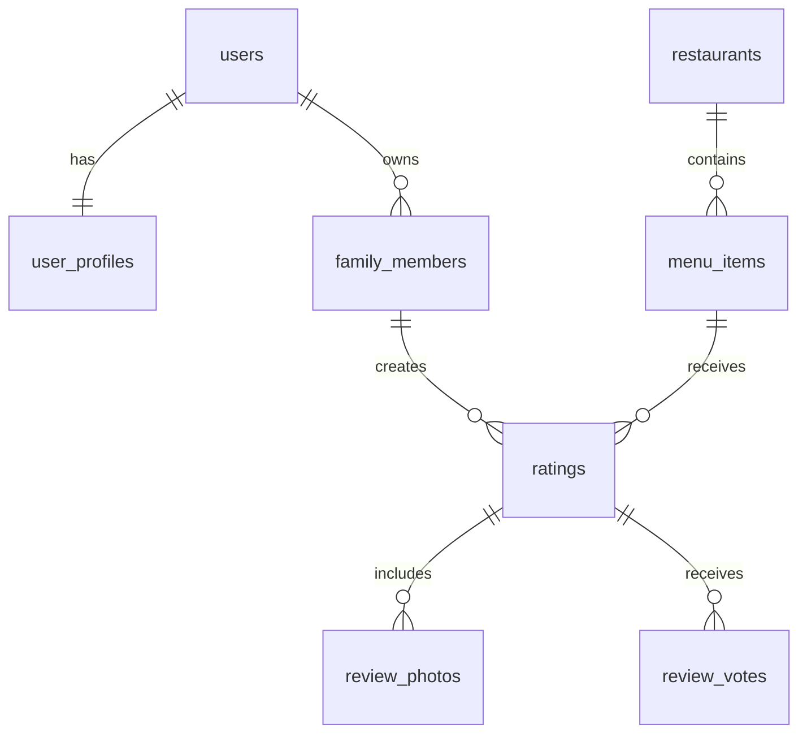
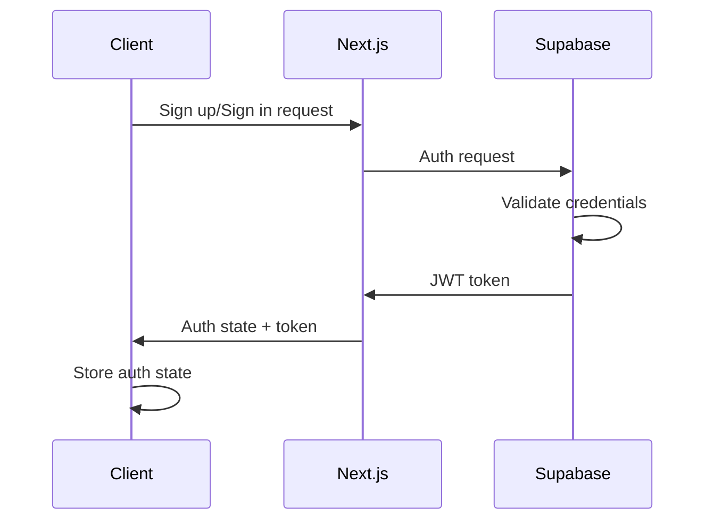

# YumZoom Technical Architecture Overview
## System Design & Infrastructure Documentation

---

## Table of Contents

1. [System Architecture](#system-architecture)
2. [Technology Stack](#technology-stack)
3. [Database Design](#database-design)
4. [API Architecture](#api-architecture)
5. [Authentication & Security](#authentication--security)
6. [Frontend Architecture](#frontend-architecture)
7. [Infrastructure & Deployment](#infrastructure--deployment)
8. [Performance & Scalability](#performance--scalability)

---

## System Architecture

### High-Level Architecture

YumZoom follows a modern **JAMstack architecture** with the following components:

```
┌─────────────────┐    ┌─────────────────┐    ┌─────────────────┐
│   Frontend      │    │   Backend       │    │   Database      │
│   (Next.js)     │◄──►│   (API Routes)  │◄──►│   (Supabase)    │
│                 │    │                 │    │   PostgreSQL    │
└─────────────────┘    └─────────────────┘    └─────────────────┘
         │                       │                       │
         ▼                       ▼                       ▼
┌─────────────────┐    ┌─────────────────┐    ┌─────────────────┐
│   PWA Service   │    │   External      │    │   File Storage  │
│   Worker        │    │   Integrations  │    │   (Supabase)    │
└─────────────────┘    └─────────────────┘    └─────────────────┘
         │                       │                       │
         ▼                       ▼                       ▼
┌─────────────────┐    ┌─────────────────┐    ┌─────────────────┐
│ Feature Flags   │    │   Analytics     │    │   Monitoring    │
│   System        │    │   Engine        │    │   & Alerting    │
└─────────────────┘    └─────────────────┘    └─────────────────┘
```

### Component Architecture

#### 1. **Frontend Layer**
- **Framework**: Next.js 14 with App Router
- **UI Components**: React 18 with TypeScript
- **Styling**: Tailwind CSS with custom component system
- **State Management**: React Context API with custom hooks
- **PWA**: Service Worker for offline capabilities
- **Feature Flags**: Dynamic feature control system

#### 2. **Backend Layer**
- **API Framework**: Next.js API Routes
- **Database**: Supabase (PostgreSQL) with real-time subscriptions
- **Authentication**: Supabase Auth with Row Level Security
- **File Storage**: Supabase Storage for images and documents
- **Feature Management**: Dynamic feature flag API endpoints

#### 3. **Data Layer**
- **Primary Database**: PostgreSQL (Supabase)
- **Real-time Features**: Supabase Realtime
- **File Storage**: Supabase Storage
- **Caching**: Browser cache and Supabase edge caching
- **Feature Control**: Feature flags database with audit trails

---

## Technology Stack

### Frontend Technologies
```yaml
Core Framework:
  - Next.js: 14.2.32
  - React: 18.2.0
  - TypeScript: 5.3.2

Styling & UI:
  - Tailwind CSS: 3.3.6
  - Lucide React: 0.294.0 (Icons)
  - React Hot Toast: 2.4.1 (Notifications)

Forms & Validation:
  - React Hook Form: 7.62.0
  - Zod: 3.22.4

Charts & Analytics:
  - Recharts: 3.1.2

PWA & Mobile:
  - Next PWA: 5.6.0
  - Workbox: 7.3.0

Utilities:
  - Date-fns: 4.1.0
  - clsx: 2.1.1
  - Tailwind Merge: 3.3.1
```

### Backend Technologies
```yaml
Runtime:
  - Node.js: 18+
  - Next.js API Routes

Database & Backend:
  - Supabase: 2.38.4
  - PostgreSQL: Latest (via Supabase)

Authentication:
  - Supabase Auth
  - JWT Tokens
  - Row Level Security (RLS)

File Storage:
  - Supabase Storage
  - Image optimization
  - CDN distribution

External Services:
  - Email: Nodemailer 6.10.1
  - 2FA: OTPLib 12.0.1
  - QR Codes: QRCode.react 3.1.0
```

### Development Tools
```yaml
Development:
  - ESLint: 8.54.0
  - Prettier: 3.1.0
  - TypeScript: 5.3.2

Build Tools:
  - PostCSS: 8.4.32
  - Autoprefixer: 10.4.16
  - Webpack (via Next.js)

Package Management:
  - npm (primary)
  - Node.js 18+
```

---

## Database Design

### Core Database Schema

#### Primary Tables
```sql
-- User management
auth.users              -- Supabase auth users
user_profiles           -- Extended user information
family_members          -- Family member profiles

-- Restaurant data
restaurants             -- Restaurant information
menu_items              -- Menu items per restaurant
ratings                 -- User ratings for menu items

-- Enhanced features
review_photos           -- Photo attachments for reviews
review_votes            -- Community helpfulness voting
user_preferences        -- User dietary restrictions & preferences
```

#### Extended Features Tables
```sql
-- Analytics & Gamification
user_challenges         -- Personal and family challenges
user_goals              -- SMART goal tracking
achievement_unlocks     -- User achievement records
leaderboard_entries     -- Competition tracking

-- Social Features
social_connections      -- User follow relationships
family_voting_sessions  -- Collaborative decision making
activity_feeds          -- Social activity tracking

-- Business Platform
restaurant_owners       -- Restaurant owner verification
owner_responses         -- Responses to reviews
subscription_plans      -- Business subscription tiers
restaurant_subscriptions -- Active subscriptions

-- Advanced Features
search_analytics        -- Search pattern tracking
notification_preferences -- User notification settings
privacy_settings        -- Granular privacy controls
```

### Database Relationships

#### Core Entity Relationships


---

## API Architecture

### API Structure Overview

YumZoom uses **Next.js API Routes** with a RESTful design pattern:

```
/api/
├── v1/                     # Public API (versioned)
│   ├── restaurants/        # Restaurant data
│   ├── middleware.ts       # API authentication
│   └── ratings/           # Public ratings
├── analytics/             # Family analytics
├── auth/                  # Authentication
├── business-platform/     # Business features
├── integrations/          # Third-party integrations
├── privacy/              # GDPR/CCPA compliance
├── restaurant-owners/     # Owner features
├── security/             # Security features
└── admin/                # Admin functions
```

### API Design Patterns

#### 1. **RESTful Endpoints**
```typescript
// Standard CRUD operations
GET    /api/restaurants          // List restaurants
GET    /api/restaurants/[id]     // Get specific restaurant
POST   /api/restaurants          // Create restaurant (admin)
PUT    /api/restaurants/[id]     // Update restaurant
DELETE /api/restaurants/[id]     // Delete restaurant (admin)
```

#### 2. **Response Format**
```typescript
interface ApiResponse<T> {
  success: boolean;
  data?: T;
  error?: {
    code: string;
    message: string;
    details?: any;
  };
  pagination?: {
    page: number;
    limit: number;
    total: number;
    hasMore: boolean;
  };
}
```

#### 3. **Authentication Middleware**
```typescript
// Request authentication
async function authenticateRequest(request: NextRequest) {
  const token = request.headers.get('authorization')?.replace('Bearer ', '');
  const { data: { user }, error } = await supabase.auth.getUser(token);
  return { user, error };
}
```

---

## Authentication & Security

### Authentication Flow

#### 1. **User Authentication**


#### 2. **Row Level Security (RLS)**
```sql
-- Example RLS policy
CREATE POLICY "Users can view their own ratings" ON ratings
    FOR SELECT USING (auth.uid() = user_id);

CREATE POLICY "Users can insert their own ratings" ON ratings
    FOR INSERT WITH CHECK (auth.uid() = user_id);
```

### Security Features

#### 1. **Data Protection**
- **Encryption**: All data encrypted in transit and at rest
- **RLS Policies**: Database-level access control
- **Input Validation**: Zod schema validation
- **CSRF Protection**: Built-in Next.js protection

#### 2. **Privacy Compliance**
- **GDPR Compliance**: Data export and deletion
- **CCPA Compliance**: Privacy rights management
- **Child Protection**: Automatic safety controls
- **Consent Management**: Granular privacy controls

#### 3. **API Security**
- **Rate Limiting**: API request throttling
- **API Key Authentication**: For business platform
- **CORS Configuration**: Controlled cross-origin access
- **Request Validation**: Schema-based validation

---

## Frontend Architecture

### Component Architecture

#### 1. **Component Hierarchy**
```
app/
├── layout.tsx              # Root layout
├── page.tsx               # Home page
├── (auth)/                # Authentication pages
├── dashboard/             # User dashboard
├── restaurants/           # Restaurant pages
├── analytics/             # Analytics dashboard
├── family/               # Family management
└── ...                   # Other feature pages

components/
├── ui/                   # Base UI components
├── auth/                 # Authentication components
├── restaurant/           # Restaurant-specific components
├── analytics/            # Analytics components
├── social/               # Social features
├── pwa/                  # PWA components
└── layouts/              # Layout components
```

#### 2. **State Management**
```typescript
// Context-based state management
interface AuthContextType {
  user: User | null;
  loading: boolean;
  signIn: (data: SignInData) => Promise<void>;
  signOut: () => Promise<void>;
  // ... other auth methods
}

// Custom hooks for feature-specific state
function useRestaurants() {
  // Restaurant data management
}

function useAnalytics() {
  // Analytics data management
}
```

#### 3. **TypeScript Integration**
```typescript
// Comprehensive type definitions
interface Restaurant {
  id: string;
  name: string;
  cuisine_type?: string;
  // ... other properties
}

interface Rating {
  id: string;
  user_id: string;
  menu_item_id: string;
  rating: number;
  // ... other properties
}
```

### PWA Architecture

#### 1. **Service Worker**
```javascript
// Service worker for offline functionality
self.addEventListener('fetch', (event) => {
  if (event.request.url.includes('/api/restaurants')) {
    event.respondWith(
      caches.match(event.request)
        .then(response => response || fetch(event.request))
    );
  }
});
```

#### 2. **Offline Strategy**
- **Cache First**: Static assets and UI components
- **Network First**: Dynamic data with fallback
- **Background Sync**: Offline actions sync when online

---

## Infrastructure & Deployment

### Deployment Architecture

#### 1. **Hosting & CDN**
```yaml
Primary Hosting:
  - Platform: Vercel (recommended)
  - Alternative: Netlify, AWS Amplify
  
CDN:
  - Static Assets: Vercel Edge Network
  - Images: Supabase CDN
  - Global Distribution: Multi-region
```

#### 2. **Environment Configuration**
```bash
# Production Environment Variables
NEXT_PUBLIC_SUPABASE_URL=your-supabase-url
NEXT_PUBLIC_SUPABASE_ANON_KEY=your-anon-key
SUPABASE_SERVICE_ROLE_KEY=your-service-key
NEXTAUTH_SECRET=your-auth-secret
NEXT_PUBLIC_APP_URL=https://your-domain.com
```

#### 3. **CI/CD Pipeline**
```yaml
# GitHub Actions workflow
name: Deploy to Production
on:
  push:
    branches: [main]
jobs:
  deploy:
    runs-on: ubuntu-latest
    steps:
      - name: Checkout code
      - name: Setup Node.js
      - name: Install dependencies
      - name: Run tests
      - name: Build application
      - name: Deploy to Vercel
```

### Monitoring & Analytics

#### 1. **Performance Monitoring**
- **Core Web Vitals**: Lighthouse CI integration
- **Real User Monitoring**: Vercel Analytics
- **Error Tracking**: Built-in error boundaries
- **API Monitoring**: Response time tracking

#### 2. **Business Analytics**
- **User Analytics**: Custom analytics dashboard
- **Feature Usage**: Event tracking
- **Performance Metrics**: Database query optimization
- **Security Monitoring**: Access pattern analysis

---

## Performance & Scalability

### Performance Optimizations

#### 1. **Frontend Performance**
```typescript
// Code splitting and lazy loading
const Analytics = lazy(() => import('@/components/analytics/AnalyticsDashboard'));

// Image optimization
import Image from 'next/image';
<Image
  src={restaurant.image_url}
  alt={restaurant.name}
  width={300}
  height={200}
  priority={index < 3}
/>
```

#### 2. **Database Optimization**
```sql
-- Optimized indexes
CREATE INDEX idx_ratings_user_menu ON ratings(user_id, menu_item_id);
CREATE INDEX idx_restaurants_cuisine ON restaurants(cuisine_type);
CREATE INDEX idx_menu_items_restaurant ON menu_items(restaurant_id);
```

#### 3. **Caching Strategy**
- **Static Generation**: Restaurant pages
- **Incremental Static Regeneration**: Dynamic content
- **Client-side Caching**: User data and preferences
- **CDN Caching**: Static assets and images

### Scalability Considerations

#### 1. **Database Scaling**
- **Connection Pooling**: Supabase connection management
- **Read Replicas**: Geographic distribution
- **Query Optimization**: Efficient database queries
- **Data Partitioning**: Large table management

#### 2. **Application Scaling**
- **Serverless Functions**: Auto-scaling API routes
- **Edge Computing**: Global content distribution
- **Load Balancing**: Automatic traffic distribution
- **Horizontal Scaling**: Multi-instance deployment

#### 3. **Monitoring & Alerting**
- **Performance Metrics**: Response time monitoring
- **Error Rates**: Automatic error detection
- **Resource Usage**: Memory and CPU monitoring
- **User Experience**: Real user metrics

---

## Related Documentation

For detailed information on specific components, see:

- [API Endpoints Documentation](./TECHNICAL_API_DOCUMENTATION.md)
- [Database Schema Documentation](./TECHNICAL_DATABASE_DOCUMENTATION.md)
- [Authentication & Security Documentation](./TECHNICAL_SECURITY_DOCUMENTATION.md)
- [Integration Documentation](./TECHNICAL_INTEGRATIONS_DOCUMENTATION.md)
- [Component Documentation](./TECHNICAL_FRONTEND_DOCUMENTATION.md)

---

## Version Information

- **Architecture Version**: 1.0
- **Last Updated**: August 2025
- **Next.js Version**: 14.2.32
- **Supabase SDK**: 2.38.4

---

*This technical architecture provides the foundation for YumZoom's scalable, secure, and performant family restaurant discovery platform.*
